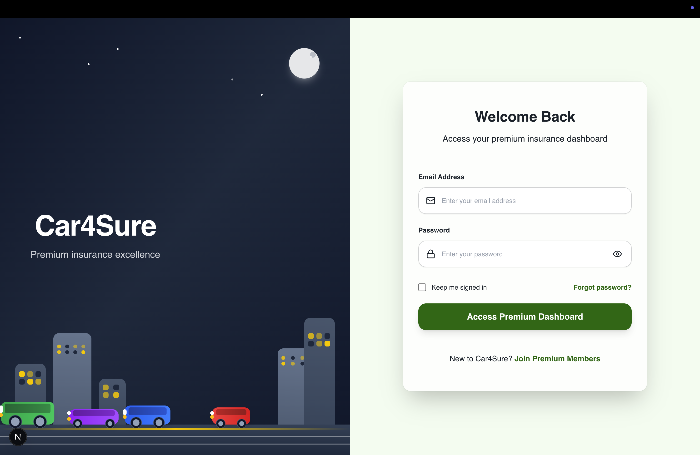

# Car4Sure Backend API

Premium Insurance Policy Management System - Laravel Backend API



## 🚀 Overview

Car4Sure Backend is a robust, scalable API built with Laravel 11 that powers the insurance policy management system. It provides secure authentication, comprehensive policy management, and PDF generation capabilities with a modular, multi-tenant architecture.

## ✨ Features

### 🔐 Authentication & Security
- **Laravel Sanctum** - Token-based API authentication
- **Rate Limiting** - API request throttling
- **CORS Configuration** - Cross-origin resource sharing

### 📋 Policy Management API
- **CRUD Operations** - Complete policy lifecycle management
- **Advanced Search** - Filter policies by status, holder name, etc.
- **Pagination** - Efficient data retrieval
- **Validation** - Comprehensive request validation
- **File Storage** - Policy document management

### 🎯 Core Features
- **PDF Generation** - Policy document creation with DomPDF
- **Database Migrations** - Version-controlled schema management
- **Seeders** - Sample data for development
- **API Resources** - Structured JSON responses

## 🛠 Tech Stack

### Core Framework
- **[Laravel 11](https://laravel.com/)** - PHP web framework
- **[PHP 8.2+](https://www.php.net/)** - Server-side scripting

### Database & Storage
- **[MySQL 8.0+](https://www.mysql.com/)** - Primary database
- **[Redis](https://redis.io/)** - Caching and sessions
- **Laravel Storage** - File system abstraction

### Authentication & Security
- **[Laravel Sanctum](https://laravel.com/docs/sanctum)** - API authentication
- **[Laravel Gates & Policies](https://laravel.com/docs/authorization)** - Authorization
- **CORS Middleware** - Cross-origin requests

### Additional Packages
- **[DomPDF](https://github.com/barryvdh/laravel-dompdf)** - PDF generation
- **[Laravel CORS](https://github.com/fruitcake/laravel-cors)** - CORS handling
- **[nwidart/laravel-modules](https://nwidart.com/laravel-modules/)** - Modular architecture

## 📁 Project Structure

```
├── app/
│   ├── Http/
│   │   ├── Controllers/           # API Controllers
│   │   │   ├── Auth/             # Authentication controllers
│   │   │   └── PolicyController.php
│   │   ├── Middleware/           # Custom middleware
│   │   ├── Requests/             # Form request validation
│   │   │   ├── StorePolicyRequest.php
│   │   │   └── UpdatePolicyRequest.php
│   │   └── Resources/            # API response resources
│   │       └── PolicyResource.php
│   ├── Models/                   # Eloquent models
│   │   ├── User.php
│   │   └── Policy.php
│   ├── Providers/                # Service providers
│   └── Services/                 # Business logic services
│       └── PolicyPdfService.php
├── database/
│   ├── migrations/               # Database migrations
│   │   ├── create_users_table.php
│   │   ├── create_policies_table.php
│   │   └── create_personal_access_tokens_table.php
│   ├── seeders/                  # Database seeders
│   │   ├── DatabaseSeeder.php
│   │   └── PolicySeeder.php
│   └── factories/                # Model factories
├── routes/
│   ├── api.php                   # API routes
│   ├── web.php                   # Web routes
│   └── auth.php                  # Authentication routes
├── config/                       # Configuration files
│   ├── auth.php                  # Authentication config
│   ├── cors.php                  # CORS configuration
│   └── sanctum.php               # Sanctum configuration
├── resources/
│   └── views/
│       └── policies/
│           └── pdf.blade.php     # PDF template
├── storage/                      # File storage
│   ├── app/
│   │   └── public/
│   │       └── policies/         # Generated PDFs
│   └── logs/                     # Application logs
└── tests/                        # Test files
    ├── Feature/                  # Feature tests
    └── Unit/                     # Unit tests
```

## 🚀 Getting Started

### Prerequisites

- **PHP 8.2+** - [Install PHP](https://www.php.net/downloads)
- **Composer** - [Install Composer](https://getcomposer.org/download/)
- **MySQL 8.0+** - [Install MySQL](https://dev.mysql.com/downloads/)
- **Redis** - [Install Redis](https://redis.io/download) (optional)
- **Git** - Version control

### Installation

1. **Clone the repository**
   ```bash
   git clone https://github.com/your-username/car4sure-backend.git
   cd car4sure-backend
   ```

2. **Install PHP dependencies**
   ```bash
   composer install
   ```

3. **Environment Setup**
   ```bash
   cp .env.example .env
   ```

4. **Generate application key**
   ```bash
   php artisan key:generate
   ```

5. **Configure database** (Update `.env` file)
   ```env
   DB_CONNECTION=mysql
   DB_HOST=127.0.0.1
   DB_PORT=3306
   DB_DATABASE=car4sure
   DB_USERNAME=your_username
   DB_PASSWORD=your_password
   ```

6. **Configure frontend URL**
   ```env
   FRONTEND_URL=http://localhost:3000
   SANCTUM_STATEFUL_DOMAINS=localhost,localhost:3000,127.0.0.1,127.0.0.1:3000
   ```

7. **Run database migrations**
   ```bash
   php artisan migrate
   ```

8. **Seed the database** (optional)
   ```bash
   php artisan db:seed
   ```

9. **Create storage symlink**
   ```bash
   php artisan storage:link
   ```

10. **Start the development server**
    ```bash
    php artisan serve
    ```

The API will be available at [http://localhost:8000](http://localhost:8000)

## 🔧 Available Commands

### Development
- **`php artisan serve`** - Start development server
- **`php artisan tinker`** - Interactive REPL
- **`php artisan route:list`** - List all routes
- **`php artisan make:controller`** - Create controller
- **`php artisan make:model`** - Create model
- **`php artisan make:migration`** - Create migration

### Database
- **`php artisan migrate`** - Run migrations
- **`php artisan migrate:rollback`** - Rollback migrations
- **`php artisan db:seed`** - Run seeders
- **`php artisan migrate:fresh --seed`** - Fresh migration with seeds

### Cache & Optimization
- **`php artisan cache:clear`** - Clear application cache
- **`php artisan config:cache`** - Cache configuration
- **`php artisan route:cache`** - Cache routes
- **`php artisan view:cache`** - Cache views

### Testing
- **`php artisan test`** - Run tests
- **`./vendor/bin/phpunit`** - Run PHPUnit tests
- **`php artisan test --coverage`** - Run tests with coverage

## 🌐 API Endpoints

### Authentication Endpoints

| Method | Endpoint | Description | Auth Required |
|--------|----------|-------------|---------------|
| POST | `/api/register` | User registration | No |
| POST | `/api/login` | User login | No |
| POST | `/api/logout` | User logout | Yes |
| GET | `/api/user` | Get authenticated user | Yes |
| POST | `/api/forgot-password` | Request password reset | No |
| POST | `/api/reset-password` | Reset password | No |

### Policy Management Endpoints

| Method | Endpoint | Description | Auth Required |
|--------|----------|-------------|---------------|
| GET | `/api/policies` | List policies with pagination/search | Yes |
| POST | `/api/policies` | Create new policy | Yes |
| GET | `/api/policies/{id}` | Get policy details | Yes |
| PUT | `/api/policies/{id}` | Update policy | Yes |
| DELETE | `/api/policies/{id}` | Delete policy | Yes |
| POST | `/api/policies/{id}/pdf` | Generate policy PDF | Yes |

### Example API Response

```json
{
  "data": [
    {
      "id": 1,
      "policyNo": "POL-2025-001",
      "policyStatus": "Active",
      "policyType": "Auto",
      "policyEffectiveDate": "2025-01-01",
      "policyExpirationDate": "2026-01-01",
      "policyHolder": {
        "firstName": "John",
        "lastName": "Doe",
        "address": {
          "street": "123 Main St",
          "city": "Anytown",
          "state": "CA",
          "zip": "12345"
        }
      },
      "drivers": [...],
      "vehicles": [...],
      "createdAt": "2025-08-20T16:38:03.000000Z",
      "updatedAt": "2025-08-20T16:38:03.000000Z"
    }
  ],
  "meta": {
    "current_page": 1,
    "last_page": 5,
    "per_page": 15,
    "total": 73,
    "from": 1,
    "to": 15
  }
}
```

## 🔒 Authentication

The API uses **Laravel Sanctum** for token-based authentication:

1. **Login** to receive an access token
2. **Include token** in Authorization header: `Bearer {token}`
3. **Token expires** based on configuration
4. **Logout** to revoke token

### Example Authentication Flow

```bash
# Login
curl -X POST http://localhost:8000/api/login \
  -H "Content-Type: application/json" \
  -d '{"email":"user@example.com","password":"password"}'

# Response
{
  "user": {...},
  "token": "1|abc123...",
  "message": "Login successful"
}

# Use token in subsequent requests
curl -X GET http://localhost:8000/api/policies \
  -H "Authorization: Bearer 1|abc123..."
```

## 📊 Database Schema

### Users Table
```sql
CREATE TABLE users (
    id BIGINT UNSIGNED PRIMARY KEY,
    name VARCHAR(255) NOT NULL,
    email VARCHAR(255) UNIQUE NOT NULL,
    email_verified_at TIMESTAMP NULL,
    password VARCHAR(255) NOT NULL,
    remember_token VARCHAR(100) NULL,
    created_at TIMESTAMP NULL,
    updated_at TIMESTAMP NULL
);
```

### Policies Table
```sql
CREATE TABLE policies (
    id BIGINT UNSIGNED PRIMARY KEY,
    user_id BIGINT UNSIGNED NOT NULL,
    policy_no VARCHAR(255) UNIQUE NOT NULL,
    policy_status ENUM('Active','Inactive','Cancelled','Expired','Pending') DEFAULT 'Pending',
    policy_type VARCHAR(255) DEFAULT 'Auto',
    policy_effective_date DATE NOT NULL,
    policy_expiration_date DATE NOT NULL,
    policy_holder JSON NOT NULL,
    drivers JSON NOT NULL,
    vehicles JSON NOT NULL,
    created_at TIMESTAMP NULL,
    updated_at TIMESTAMP NULL,
    FOREIGN KEY (user_id) REFERENCES users(id) ON DELETE CASCADE
);
```

## 🧪 Testing

### Running Tests

```bash
# Run all tests
php artisan test

# Run specific test class
php artisan test --filter PolicyTest

# Run with coverage
php artisan test --coverage
```

### Example Test

```php
<?php

namespace Tests\Feature;

use Tests\TestCase;
use App\Models\User;
use Laravel\Sanctum\Sanctum;

class PolicyTest extends TestCase
{
    public function test_user_can_create_policy()
    {
        Sanctum::actingAs(User::factory()->create());

        $response = $this->postJson('/api/policies', [
            'policy_type' => 'Auto',
            'policy_effective_date' => '2025-01-01',
            'policy_expiration_date' => '2026-01-01'
        ]);

        $response->assertStatus(201)
                ->assertJsonStructure(['data', 'message']);
    }
}
```

## 📈 Performance Optimization

### Database Optimization
- **Indexes** on frequently queried columns
- **Query optimization** with Eloquent relationships
- **Database caching** with Redis
- **Connection pooling** for high traffic

### Application Optimization
- **OPcache** for PHP bytecode caching
- **Route caching** for faster route resolution
- **Config caching** for configuration optimization
- **Queue jobs** for heavy operations

### Monitoring
- **Laravel Telescope** for debugging
- **Application logs** in storage/logs
- **Performance monitoring** with APM tools
- **Health checks** for system monitoring

## 🔧 Configuration

### Key Configuration Files

- **`config/auth.php`** - Authentication configuration
- **`config/cors.php`** - CORS settings
- **`config/sanctum.php`** - Sanctum configuration
- **`config/database.php`** - Database connections
- **`config/cache.php`** - Caching configuration

### Environment Variables

```env
# Application
APP_NAME=Car4Sure
APP_ENV=local
APP_KEY=base64:...
APP_DEBUG=true
APP_URL=http://localhost:8000

# Database
DB_CONNECTION=mysql
DB_HOST=127.0.0.1
DB_PORT=3306
DB_DATABASE=car4sure
DB_USERNAME=root
DB_PASSWORD=

# Frontend
FRONTEND_URL=http://localhost:3000
SANCTUM_STATEFUL_DOMAINS=localhost,localhost:3000,127.0.0.1,127.0.0.1:3000

# Cache & Session
CACHE_DRIVER=file
SESSION_DRIVER=file
QUEUE_CONNECTION=sync

# Mail
MAIL_MAILER=smtp
MAIL_HOST=mailpit
MAIL_PORT=1025
```


